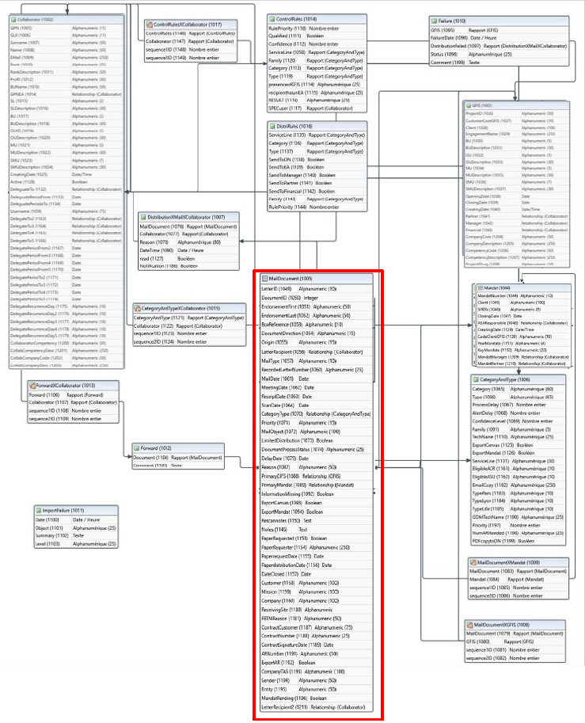
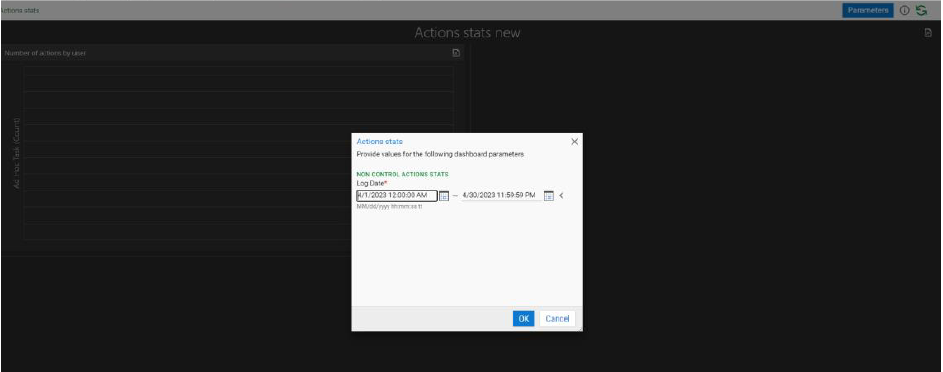
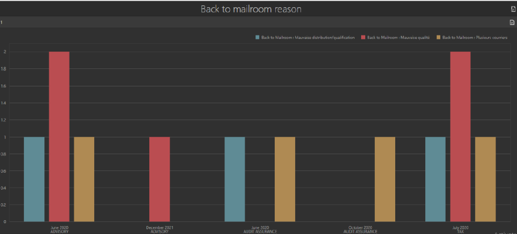

La data et le reporting dans 2 exemples de mes projets opérations

# 1 - Dématérialisation de courrier entrant  - Monitoring des opérations

> [!NOTE]
> NB : Visuels indicatifs de développement, à titre d'illustration

## Contexte 
Projet de mise en place d'une solution de dématéralisation de courrier entrant pour un cabinet d'audit et de conseil, puis maintenance de la solution.

### Le process en ultra-bref

scan > import > indexation > traitement business > export pour archivage

### Stack
Windows server-IIS/SQL Server/MS Azure/O365
Hyland OnBase - C# et SQL

## Cherchez la data
La data est partout et capitale dans ce type de projet qui semble centré sur le document mais repose surtout sur une base de données structurée, des workflows bien calibrés, des classes bien organisées :
* Données métier (décrivant pour un objet courrier le client, la mission, le type de document, d'affranchissement, les destinataires, le courrier en lui-même, etc.)
* Données techniques (identifiants de batch, de machines, horadatage, statuts de workflows, de jobs, données de paramétrage, etc.)
* Données issues de référentiels (ici utilisateurs, clients, missions)
qu'il faut:
* identifier
* formater
* contrôler
* organiser dans un modèle de données 
* faire fonctionner
* documenter
* maintenir

## Focus Besoin de reporting 
Au sein de la solution même,
> mettre à disposition le monitoring de la solution, du point de vue de l'éxécution automatique (imports de documents, workflows de traitements, exports)
mais aussi des actions utlisateurs au sein des workflows fontionnels.
> monitorer la mise à jour automatisée quotidienne des données utiles issues de 3 référentiels client

### Actions mises en place 
> Monitoring de la solution : 
Utilisation du module Reporting Dashboards du progiciel utilisé OnBase (Hyland)
Accès via client lourd ou via le client web directement par URL, déjà exploités par les utilisateurs métier pour les workflows fonctionnels comme services et techniques pour les worflows de traitement.
Droits d'accès aux dashboards selon les groupes utilisateurs et rôles associés

> Monitoring de la mise à jour automatisée quotidienne des données utiles issues de 3 référentiels client :  
logs spécifiques créés directement via le script d'import en C#.
Ces logs sont ensuite exploités comme des objets de la solution et consultables dans une vue dédiée aux administrateurs.
 
#### Liste des rapports dynamiques mis en place

* Actions stats
Statistiques par action utilisateur une fois le document validé (e.g. : Paper version request, PDF export, etc.), par utilisateur et groupe d'utilisateurs

* Control stats
Statistiques par action utilisateur en phase de contrôle du document (Qualify and Send, or Forward back to mailroom, and reason for forwarding back), by user and user group
Détail raisons de refus/renvoi du document après numérisation

* Import stats - month details
Imports de documents par Service et par mois (importés via scanners tiers)
* Indexing stats - month details 
Indexation des documents par service, par mois et temps moyen d'indexation
* Mailroom global stats - day 
Documents importés et indexés par batch et par jour (enveloppes exclues)
* Mailroom global stats - month 
Documents importés et indexés par batch et par mois (enveloppes exclues)
* User activity
Connexions par utilisateur et groupe d'utilisateurs par jour
* Disk Group report
Espace disque utilisé par chaque service/type sur le srveur de fichiers (NAS).
* TAX-PAS push AR auto
Nombre et ID des documents AR exportés automatiquement en PDF 
* PDF auto Email stats
Nombre et statut des emails en envoi automatique avec PDF attaché (seulement pour les services éligibles)
* License usage monitoring
License pic usage monitoring- par année, mois, jour, utilisateurs uniques

### Exemples d'améliorations identifiées grâce à ces rapports, et de résolutions d'incidents auxquelles ils ont contribué
* Ajustement de la résolution des scanners pour équilibrer volumes de fichiers et confort d'exploitation du document numérisé par l'utilisateur
* Ajustement des volumes de licenses et prévisions d'accroissement au fil du déploiement
* Identification, analyse et résolution d'une sauvergarde tierce de DB qui interrompait certains jobs
* Réactivité et reprise en cas d'incident réseau quand les envois auto d'emails ou les dépôts de pdf par la solution étaient affectés

