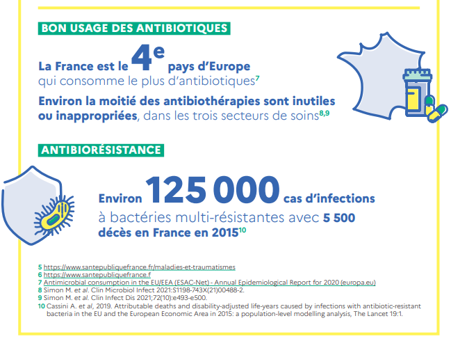
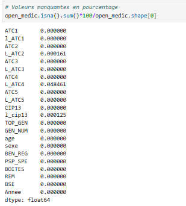
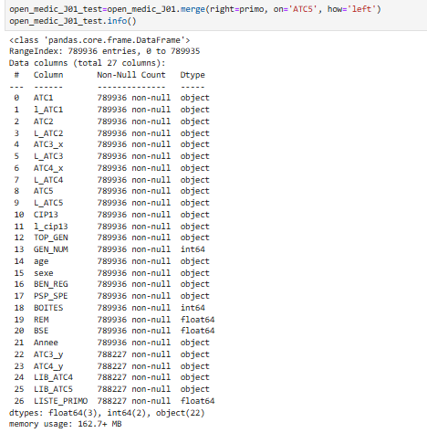
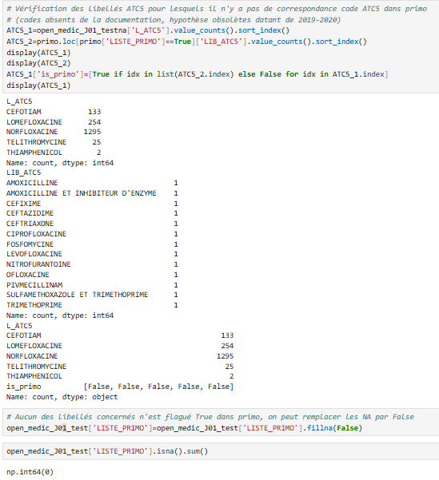
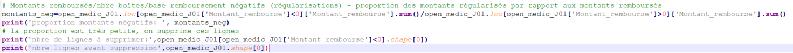
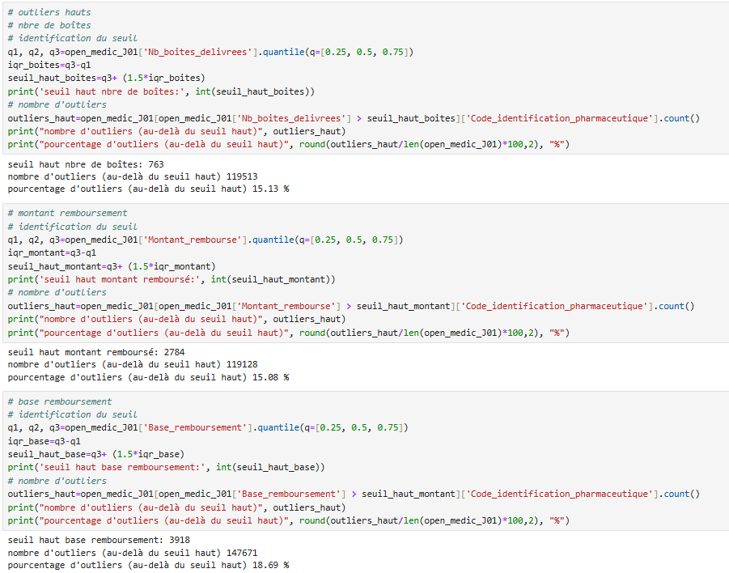
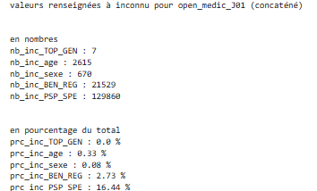

layout : page
title : "Projet Data Antibiotiques"
permalink : /projet_data_antibotiques

# Analyse ad-hoc :   Consommation des antibiotiques en France 2019-2024

> [!NOTE]
> Projet de groupe retravaillé

## Contexte 
_« L’utilisation répétée et inadaptée des antibiotiques a favorisé l’apparition de bactéries résistantes à ces
médicaments. Résultat : certaines infections deviennent de plus en plus difficiles à soigner. »_ [Source](https://www.sante.fr/antibiomalin-pour-savoir-comment-bien-utiliser-les-antibiotiques/lantibioresistance)

Ainsi la surveillance et la compréhension de la prescription et et délivrance des antibiotiques en France est un des moyens de contribuer à des actions de prévention et d' appuyer les politiques de santé publique sur l'usage raisonné des antibiotiques.
<figure>

  
  <figcaption><h6 align="center">Antibiotiques et antibiorésistance</h6></figcaption>
  

</figure>

[Source image](https://sante.gouv.fr/IMG/pdf/strategie_nationale_2022-2025_prevention_des_infections_et_de_l_antibioresistance.pdf)

### Stack
Python, PowerBI

 

 :pill: Problématique  

En étudiant les données de remboursement (montants remboursés, nombre de boîtes délivrées) selon les axes prescripteur, bénéficiaire, sous-groupes pharmacologique : 
* Quelles sont les tendances sur la période étudiée, selon les régions, les tranche d'âge, le sexe des bénéficiaires, les types de prescripteurs, les familles prescrites?
* Quels critères, situations ou territoires présentent une tendance de consommation remarquable?
* Quelles sont les relations entre les différents critères?
* Que représentent les subsantances surveillées dans le cadre de l'antibiorésistance par rapport à l'ensemble des antibiotiques délivrés en pharmacies de ville?

> [!NOTE]
> "_Ces données de remboursement [données SNDS] sont utilisées comme proxy de la consommation française, faisant l’hypothèse d’une part que toutes les prescriptions donnent lieu à remboursement, et d’autre part que l’ensemble des médicaments remboursés par l’Assurance maladie ont été consommés par les patients concernés._"[Synthèse préliminaire des indicateurs disponibles sous Géodes (11-2020)](https://www.santepubliquefrance.fr/maladies-et-traumatismes/infections-associees-aux-soins-et-resistance-aux-antibiotiques/resistance-aux-antibiotiques/documents/rapport-synthese/la-consommation-d-antibiotiques-en-secteur-de-ville-en-france-2009-2019.-synthese-preliminaire-des-indicateurs-disponibles-sous-geodes) 
> 
> Pour une approche alignée en unités avec les objectifs posés dans la [stratégie nationale 2022-2025 de prévention des infections et de l'antibioresistance](https://sante.gouv.fr/IMG/pdf/strategie_nationale_2022-2025_prevention_des_infections_et_de_l_antibioresistance.pdf), exprimés en doses définies journalières (DDJ) pour 1 000 habitants et par jour et en prescriptions pour 1 000 habitants et par an, voir le [Rapport de Santé publique France (11-2025)]( https://www.santepubliquefrance.fr/maladies-et-traumatismes/infections-associees-aux-soins-et-resistance-aux-antibiotiques/resistance-aux-antibiotiques/documents/rapport-synthese/consommation-d-antibiotiques-en-secteur-de-ville-en-france-2014-2024) 
> La notion de proxy induit qu'on devrait pouvoir observer les grandes tendances dès un premier niveau d'étude des données de remboursements, sans pouvoir toutefois s'y limiter pour une analyse appronfondie et complète. 
> 
> Dans le cadre du projet, conduit en temps limité, c'est ce premier niveau qui est travaillé pour faire ressortir les tendances et offrir des indicateurs complémentaires à ceux exprimés en DDJ et prescriptions, par exemple relatifs au type et au prix du médicament.

:file_cabinet: Sources de données utilisées

#### Principale
* Base Open Medic (données SNDS) mis à disposition librement par l’État sur la plate-forme [data.gouv.fr](https://www.data.gouv.fr/datasets/open-medic-base-complete-sur-les-depenses-de-medicaments-interregimes)
  - Dépenses de médicaments/remboursements délivrés en pharmacies de ville, selon des groupes d’éléments descriptifs bénéficiaires (tranche d'âge, sexe, région de résidence), spécialité prescripteur, type de médicament, par année.
  - Structuré selon la classification hiérarchique ATC (Anatomique, Thérapeutique et Chimique) des médicaments
  - Mise à disposition annuelle
  - Utilisation de la base principale pour les années 2019 à 2024 : 6 fichiers open_medic_AAAA.csv
  - Antibiotiques identifiés par le code ATC2 : J01-ANTIBACTERIENS A USAGE SYSTEMIQUE
  - Documentation des variables.

<figure>

  
  <figcaption><h6 align="center">Aperçu des données - Base principale Open Medic</h6></figcaption>
  

</figure>

#### Complémentaires/Contexte
* Fichier INSEE (Institut national de la statistique et des études économiques)
  - Population par région de France, sexe et grandes classes d'âge (1975-2025) (INSEE via [INED - Institut national des études démographiques](https://www.ined.fr/fichier/s_rubrique/159/estim.pop.nreg.sexe.gca.1975.2025.fr.xlsx)

* Liste PRIMO 
  - Liste des substances antibiotiques surveillées en France dans le cadre de la [mission PRIMO](https://medqualville.antibioresistance.fr/resistances/synthese) sur l'antibiorésistance

:hammer_and_wrench: Méthodologie - Etapes de traitement des données Open Medic

0. Analyse des variables et listes de valeurs, définition des formats et listes cibles
  
1. Chargement initial 
  * Import des 6 fichiers zips csv (Python)
  * Gestion de l'encodage
  * Gestion des formats de variables (colonnes)
  * Ajout et valorisation d'une colonne année
  * Normalisation des noms de colonnes
  * Concaténation des 6 fichiers
  * Contrôle des doublons
  * Contrôle des volumétries et valeurs manquantes
  <figure>

  
  <figcaption><h6 align="center">Volumes après concaténation - état initial</h6></figcaption>
  

</figure>
  <figure>

  
  <figcaption><h6 align="center">Valeurs manquantes après concaténation - état initial</h6></figcaption>
  

</figure>

2. Filtrage
  * Filtrage du dataframe sur ATC2='J01' de façon à ne conserver que le périmètre des antibiotiques
  * Contrôle des volumétries et valeurs manquantes
<figure> 
  

  
  <figcaption><h6 align="center">Volumes et valeurs manquantes après filtrage</h6></figcaption>
  

</figure>

4. Adaptation des variables
  * Suppression des variables non pertinentes
  * Renommage plus explicite des variables
  * Ajout de variables libellés en vue de la gestion des visualisations d'exploration
  * Transcodage de valeurs catégorielles
    - Exemple cas particulier du top générique, dont la codifiaction a changé au cours de la période étudiée
<figure> 
  

  
  <figcaption><h6 align="center">Codage Top Générique issu de la documentation du jeu de données</h6></figcaption>
  

</figure>
<figure> 
  

  
  <figcaption><h6 align="center">Codage Top Générique normalisé</h6></figcaption>
  

</figure>

5. Ajout de la variable indiquant si la substance est surveillée ou non pour l'antibiorésistance (merge avec la liste mission PRIMO)
<figure> 
  

  
  <figcaption><h6 align="center">Ajout variable liste Primo (merge)</h6></figcaption>
  

</figure>

  * Valorisation des valeurs manquantes liste primo à false, après vérification des lignes concernées
<figure> 
  

  
  <figcaption><h6 align="center">Gestion NA liste Primo</h6></figcaption>
  

</figure>

5. Gestion des valeurs négatives
   
  * Identifiées via describe et documentées sur la discussion Open Medic (il s'agit de régularisations de remboursements)
<figure> 
  

  
  <figcaption><h6 align="center">Describe valeurs quantitatives</h6></figcaption>
  

</figure>
<figure> 
  

  
  <figcaption><h6 align="center">Traitement montants négatifs</h6></figcaption>
  

</figure>
<figure> 
  

  
  <figcaption><h6 align="center">Traitement montants négatifs-résultat</h6></figcaption>
  

</figure>

   * Supprimées car proportion très petite et non pertinentes pour nos visualisations

6. Vérifiaction des outliers
  * On constate une grande dispersion à droite des données quantitatives : on étudie les outliers et la proportion qu'ils représentent. Ce ne sont pas des valeurs aberrantes; ils doivent être conservés.
<figure> 
  

  
  <figcaption><h6 align="center">Etude des outliers</h6></figcaption>
  

</figure>
    
    
8. Gestion des valeurs inconnues
  * Le jeu de données ne comporte pas de NA mais des valeurs renseignées à "Inconnu".
  * Les valeurs inconnues (catégorielles) des différents critères sont introduites pour préserver le secret statistique lors qu'un groupe concerne moins de 10 bénéficiaires.
  * Le remplacement par le mode par exemple créerait beaucoup d'approximation, notamment lorsqu'une ligne/un groupe présente plusieurs critères inconnus.
  * Contrôle de la proportion de lignes concernées : on conserve les lignes qui seront filtrées au besoin pour les visualisations

<figure> 
  

  
  <figcaption><h6 align="center">Pourcentages des valeurs inconnues</h6></figcaption>
  

</figure>

7. Vérification finale des doublons et valeurs manquantes
   
8. Résultats du traitement
<figure> 
  

  
  <figcaption><h6 align="center">Informations du jeu de données après traitements</h6></figcaption>
  

</figure>   

:hammer_and_wrench: Méthodologie - Etapes de traitement des données de contexte

* Fichier INSEE
  - Regroupement chiffres régions PACA et Corse pour aligner sur la répartition Open Medic
  - Regroupement chiffres pour aligner sur la répartition par tranches d'âge Open Medic
  - Concaténation des 6 onglets (1 par année) en un seul avec ajout de la colonne année
  - Normalisation des valeurs Régions, sexe et tranche d'âge
<figure> 
  

  
  <figcaption><h6 align="center">Aperçu des données INSEE brutes (exemple année 2024)</h6></figcaption>
  

</figure>

    
      
<figure> 
  

  
  <figcaption><h6 align="center">Aperçu des données INSEE après traitement</h6></figcaption>
  

</figure>   

* Liste PRIMO
  - Récupération des codes ATC5 pour les ATC3 J01
  - Valorisation d'un booléen à True si la substance ATC5 est surveillée (voir ci-dessus étape 5 traitement fichier Open medic)
   

 :gear: Modélisation Power BI

 
  <figure> 
  

  
  <figcaption><h6 align="center">Modèle Power BI</h6></figcaption>
  

</figure> 

  * Table des remboursement : Table de faits
  * Tables de dimension : Age, sexe, région bénéficiare, Prescripteur, Année, Antibiotique
  * Table Insee : Traitée comme une table de faits pour appliquer les dimensions région, année, age, sexe.
  * Table de mesures DAX
     

  

 :dart: Principaux résultats et visualisations 📊

## Exploration préalable - exemples

* Le montant remboursé et la base de remboursement ont une relation linéaire (coefficient taux de remboursement).
<figure> 
  

  
  <figcaption><h6 align="center">Relation linéaire Montant remboursé/Base de remboursement</h6></figcaption>
  

</figure>  

* Le montant remboursé (ou la base de remboursement) et le nombre de boîtes délivrées ont une corrélation statistique positive forte mais n'ont pas une relation linéaire. Il est donc intéressant/complémentaire d'observer les comportements de ces 2 variables sur les mêmes critères.
  <figure> 
  

  
  <figcaption><h6 align="center">Matrice de corrélations</h6></figcaption>
  

</figure>  
<figure> 
  

  
  <figcaption><h6 align="center">Relation non linéaire Montant remboursé/Nombre de boîtes délivrées</h6></figcaption>
  

</figure>  

## Tendance globale

## Remboursements et prix des antibiotiques

## Prescripteurs

## Familles consommées et part des substances surveillées

