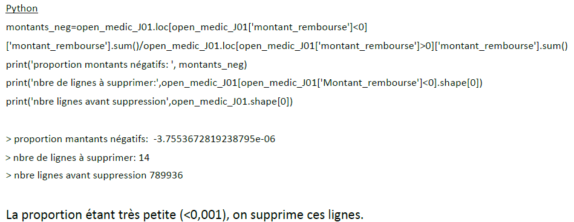

# Example Projet Data : Consommation des antibiotiques en France 2019-2024

> [!NOTE]
> Projet de groupe retravaillé

## Contexte 
_« L’utilisation répétée et inadaptée des antibiotiques a favorisé l’apparition de bactéries résistantes à ces
médicaments. Résultat : certaines infections deviennent de plus en plus difficiles à soigner. »_ [Source](https://www.sante.fr/antibiomalin-pour-savoir-comment-bien-utiliser-les-antibiotiques/lantibioresistance)

Ainsi la surveillance et la compréhension de la prescription et et délivrance des antibiotiques en France est un des moyens de contribuer à des actions de prévention et d' appuyer les politiques de santé publique sur l'usage raisonné des antibiotiques.
<figure>

  
  <figcaption><h6 align="center">Antibiotiques et antibiorésistance</h6></figcaption>
  

</figure>

[Source image](https://sante.gouv.fr/IMG/pdf/strategie_nationale_2022-2025_prevention_des_infections_et_de_l_antibioresistance.pdf)

### Problématique

Selon les axes prescripteurs, bénéficiaire, sous-groupes pharmacologiques : 
* Quels critères, situations ou territoires présenteraient un risque ou une tendance de consommation qui pourrait favoriser l’antibiorésistance?
* Quelles sont les tendances sur la période étudiée?
* Quelles sont les relations entre les différents critères?

### Stack
Python, PowerBI

## Traitement des données

### Sources de données utilisées
* Base Open Medic (données SNDS) mis à disposition librement par l’État sur la plate-forme [data.gouv.fr](https://www.data.gouv.fr/datasets/open-medic-base-complete-sur-les-depenses-de-medicaments-interregimes)
  - Dépenses de médicaments/remboursements délivrés en pharmacies de ville, selon des groupes d’éléments descriptifs bénéficiaires (tranche d'âge, sexe, région de résidence), spécialité prescripteur, type de médicament, par année.
  - Structuré selon la classification hiérarchique ATC (Anatomique, Thérapeutique et Chimique) des médicaments
  - Mise à disposition annuelle
  - Utilisation de la base principale pour les années 2019 à 2024 : 6 fichiers open_medic_AAAA.csv
  - Antibiotiques identifiés par le code ATC2 : J01-ANTIBACTERIENS A USAGE SYSTEMIQUE
  - Documentation des variables.

<figure>

  
  <figcaption><h6 align="center">Aperçu des données - Base principale Open Medic</h6></figcaption>
  

</figure>

* Fichier INSEE (Institut national de la statistique et des études économiques)
  - Population par région de France, sexe et grandes classes d'âge (1975-2025) (INSEE via [INED - Institut national des études démographiques](https://www.ined.fr/fichier/s_rubrique/159/estim.pop.nreg.sexe.gca.1975.2025.fr.xlsx)

### Méthodologie - Etapes de traitement
* Analyse des variables et listes de valeurs, définition des formats et listes cibles
  
1. Chargement initial 
  * Import des 6 fichiers zips csv (Python)
  * Gestion de l'encodage
  * Gestion des formats de variables (colonnes)
  * Ajout et valorisation d'une colonne année
  * Normalisation des noms de colonnes
  * Concaténation des 6 fichiers
  * Contrôle des doublons
  * Contrôle des volumétries et valeurs manquantes
  <figure>

  
  <figcaption><h6 align="center">Volumes et valeurs manquantes après concaténation - état initial</h6></figcaption>
  

</figure>

2. Filtrage
  * Filtrage du dataframe sur ATC2='J01' de façon à ne conserver que le périmètre des antibiotiques
  * Contrôle des volumes
<figure> 
  

  
  <figcaption><h6 align="center">Volumes après filtrage</h6></figcaption>
  

</figure>

3. Adaptation des variables
  * Suppression des variables non pertinentes
  * Renommage plus explicite des variables
  * Ajout de variables libellés en vue de la gestion des visualisations d'exploration
  * Transcodage de valeurs catégorielles
    - Exemple cas particulier du top générique, dont la codifiaction a changé au cours de la période étudiée
<figure> 
  

  
  <figcaption><h6 align="center">Codage Top Générique issu de la documentation du jeu de données</h6></figcaption>
  

</figure>
<figure> 
  

  
  <figcaption><h6 align="center">Codage Top Générique normalisé</h6></figcaption>
  

</figure>

4. Gestion des valeurs négatives
  * Identifiées via describe et documentées sur la discussion Open Medic (il s'agit de régularisations de remboursements)
<figure> 
  

  
  <figcaption><h6 align="center">Valeurs négatives</h6></figcaption>
  

</figure>

6. Gestion des valeurs inconnues
  * Le jeu de données ne comporte pas de NA mais des valeurs renseignées à "Inconnu".
  * Les valeurs inconnues (catégorielles) des différents critères sont introduites pour préserver le secret statistique lors qu'un groupe concerne moins de 10 bénéficiaires.
  * Le remplacement par le mode par exemple créerait beaucoup d'approximation, notamment lorsqu'une ligne/un groupe présente plusieurs critères inconnus.
  * Contrôle de la proportion de lignes concernées

<figure> 
  

  
  <figcaption><h6 align="center">Pourcentages des valeurs inconnues</h6></figcaption>
  

</figure>

7. 
### Featuring
* Liste PRIMO https://medqualville.antibioresistance.fr/resistances/synthese
<figure>

  
  <figcaption><h6 align="center">Version de travail du modèle de données</h6></figcaption>
  

</figure>

7. Vérification finale des doublons et valeurs manquantes

